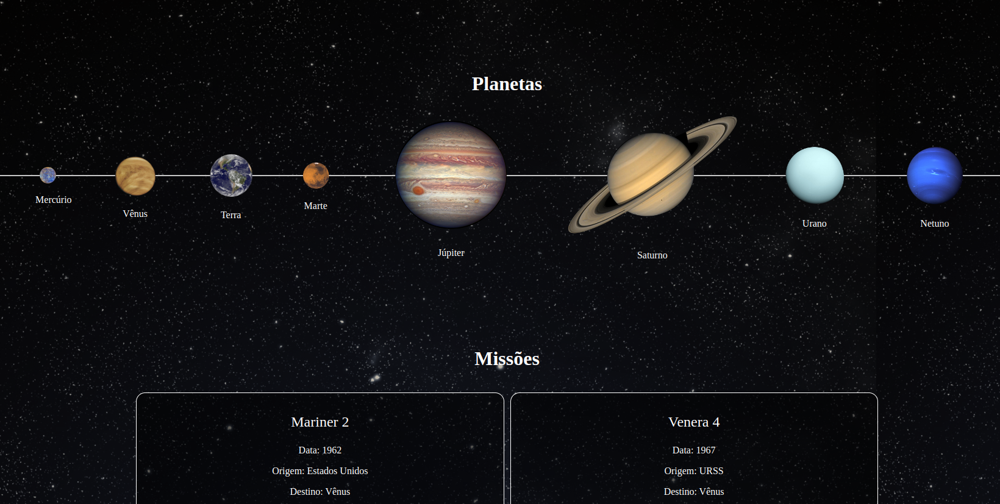

# README: Solar System



## Project Description

This is my first project using TypeScript for the backend module. The purpose of this exercise is to write functions for adding and finding products, as well as handling order requests.

### Technologies

- LINUX
- VSCODE
- TYPESCRIPT
- VITE
- REACT

### What I Learned

- How to render multiple components and organize them on the screen
- How to add data from multiple sources to a card 

## How to Run the Project

1. Clone the repository:

   ```bash
   git clone https://github.com/feduarte-dev/solar-system
   ```

2. Navigate to the project directory:

   ```bash
   cd your-repository
   ```

3. Install dependencies:

   ```bash
   npm install
   ```

4. Run the application:

   ```bash
   npm run dev
   ```

## Contributions

[Felipe](https://www.linkedin.com/in/feduarte-dev/) -  /src


[Trybe](https://www.betrybe.com/) - Everything else
